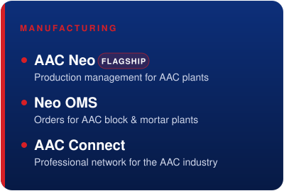
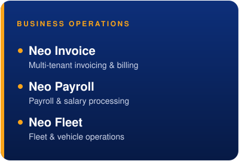

  

  <b>We build software that runs real operations: plant floors, dispatch yards, finance desks.</b> 
  This is the engineering team at <a href="https://github.com/technizer-edge"><b>@technizer-edge</b></a>. We design, ship and run it, from the database up to the Android app in the operator's hand.

---

### 🚀 Currently shipping: [AAC Neo](https://aacneo.com)

- **Production management for AAC block plants**, in production at plants across India
- **One codebase for each surface:** a Next.js web app with a REST API, an Expo Android app on Google Play, and a multi-tenant admin portal
- **Every client runs in its own deployment and database.** The mobile app picks its client configuration at login, and updates ship over the air, with no Play Store release needed

### 🧩 Product portfolio

  
  
  

  We also build <b>AI automation, document &amp; vision AI and cloud-native software</b> for enterprise teams. See <a href="https://technizeredge.com">technizeredge.com</a>.

### 🛠️ Stack

    
  

<b>AI</b>

  
  
  
  
  

### 📈 Activity

  

<picture>
  <source media="(prefers-color-scheme: dark)" srcset="https://raw.githubusercontent.com/Dev-Technizer-Edge/Dev-Technizer-Edge/output/snake-dark.svg">
  <source media="(prefers-color-scheme: light)" srcset="https://raw.githubusercontent.com/Dev-Technizer-Edge/Dev-Technizer-Edge/output/snake.svg">
  
</picture>

---

  
  
  

Most of our work lives in private repositories. To see it, get in touch.

